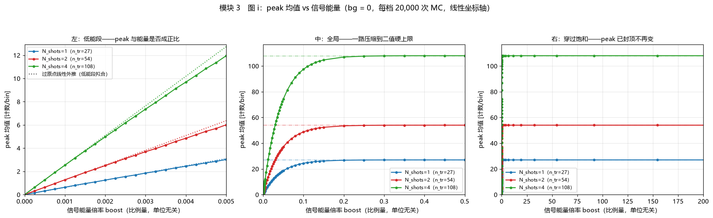
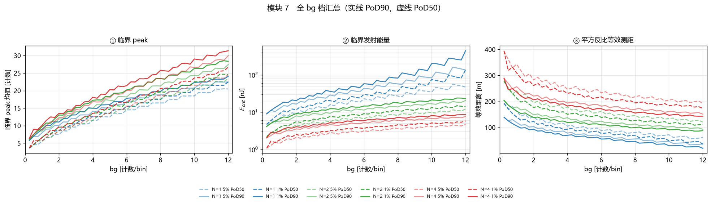

# Histogram Simulation

面向直方图式激光雷达的物理建模、二值接收、探测概率、噪声、饱和与串扰研究。

本仓库以 Jupyter Notebook 为主要交付形式，配套 Python 构建脚本、蒙特卡洛扫描脚本、落盘缓存、
无头校验脚本和逐工作线交接文档。当前 `master` 同步维护在内部仓库与 GitHub 镜像中。

> 本项目是工程研究与算法验证代码，不是量产固件，也不能替代硬件标定或安全认证。

## 缩写与术语

| 缩写或术语 | 英文全称 | 本项目中的含义 |
|---|---|---|
| LiDAR | Light Detection and Ranging | 激光探测与测距，即激光雷达 |
| TCSPC | Time-Correlated Single Photon Counting | 时间相关单光子计数 |
| TX | Transmitter | 发射端 |
| RX | Receiver | 接收端 |
| SPAD | Single-Photon Avalanche Diode | 单光子雪崩二极管 |
| IRF | Instrument Response Function | 仪器响应函数；用于描述时间抖动 |
| ToF | Time of Flight | 飞行时间 |
| PDE | Photon Detection Efficiency | 光子探测效率 |
| SNR | Signal-to-Noise Ratio | 信噪比 |
| MC | Monte Carlo | 蒙特卡洛随机仿真 |
| FAR | False Alarm Rate | 虚警率 |
| PoD | Probability of Detection | 探测概率 |
| FWHM | Full Width at Half Maximum | 半高全宽 |
| FPGA | Field-Programmable Gate Array | 现场可编程门阵列 |
| tcode | timing code | 发光时刻编码，用于打散串扰鬼影 |
| XM | XtalkMark | 串扰标记滤除 |
| `peak` | — | 统计窗内累加直方图的最大 bin 计数 |
| `bg` | background | 当前累加直方图统计窗内的实测平均底噪 |
| `boost` | — | 相对基准场景的信号能量倍率 |

## 项目做什么

仓库覆盖从光链路到检测判决的完整分析链：

```text
激光脉冲与场景参数
        │
        ▼
TX 发射 → 大气 / 目标 → RX 接收
        │
        ▼
光子到达时间 + IRF 抖动 + SPAD 响应 / 恢复
        │
        ▼
1 ns 二值采样 → 多发累加直方图 hist_add
        │
        ├──────────► peak / FWHM / SNR / 测距
        │
        ├──────────► FAR 阈值 → PoD → 临界能量 / 等效距离
        │
        ├──────────► 能量、噪声与 peak 分布扫描
        │
        └──────────► 串扰、对射、tcode 与 XM 滤除
```

核心特点：

- 从激光、发射、信道、目标、接收到探测器的可解释物理链路；
- 27 路 SPAD 宏像元、单 bin 二值响应与多发累加硬上限；
- 纯噪声阈值、探测概率、临界信号能量和距离换算；
- 信号能量、环境噪声、peak 分布和半高全宽的专题扫描；
- 模组内串扰、雷达对射、发光时刻编码和串扰标记滤除；
- 长扫描缓存、增量检查点、断点续跑和默认 20 进程并行。

## 推荐入口

仓库保留了完整版本演进。第一次使用时，建议从下表的“当前入口”开始，不要仅按文件名猜测版本关系。

| 工作线 | 当前入口 | 主要问题 | 详细说明 |
|---|---|---|---|
| 完整物理链路 | [`lidar_histogram_sim_v45.ipynb`](lidar_histogram_sim_v45.ipynb) | 光链路、SPAD 二值响应、测距、SNR、能量与距离扫描 | [`handoff_lidar_histogram_sim.md`](handoff_lidar_histogram_sim.md) |
| 探测概率 | [`PoD_esti_v30.ipynb`](PoD_esti_v30.ipynb) | 底噪 → FAR 阈值 → PoD → 临界能量与等效距离 | [`handoff_PoD_esti.md`](handoff_PoD_esti.md) |
| 信号能量专题 | [`peak_vs_energy_v01.ipynb`](peak_vs_energy_v01.ipynb) | peak、FWHM、饱和指数拟合与 5% 线性区 | [`handoff_peak_vs_energy.md`](handoff_peak_vs_energy.md) |
| 环境噪声专题 | [`peak_vs_noise_v02.ipynb`](peak_vs_noise_v02.ipynb) | 固定信号下，peak 分布如何随 noise / bg 演化 | [`handoff_peak_vs_noise.md`](handoff_peak_vs_noise.md) |
| peak 分布专题 | [`peak_distribution.ipynb`](peak_distribution.ipynb) | 信号近似翻倍时，众数、中位数、均值和分位数是否同比缩放 | [`handoff_peak_distribution.md`](handoff_peak_distribution.md) |
| 串扰与编码 | [`crosstalk_sim_v42.ipynb`](crosstalk_sim_v42.ipynb) | 模组串扰、雷达对射、tcode、XM 与一字滤波 | [`handoff_crosstalk_sim.md`](handoff_crosstalk_sim.md) |
| tcode 工具 | [`tcode_calculator_v2.ipynb`](tcode_calculator_v2.ipynb) | 离散字母表、码表搜索与零残留验证 | [`docs/tcode/`](docs/tcode/) |

各专题冻结在各自验证过的物理内核版本上。例如 `peak_distribution` 和 `peak_vs_noise` 复用
`pod_esti_v05_core.py`，而 `peak_vs_energy` 使用修复饱和覆盖判据后的 `pod_esti_v30_core.py`。
版本号更大不表示可以不经验证地替换专题内核。

## 结果预览

### peak 均值随信号能量变化



### 探测概率汇总



## 快速开始

### 1. 获取仓库

从内部仓库或 GitHub 镜像任选一个地址克隆：

```powershell
git clone <repository-url>
Set-Location histogram_simulation
```

### 2. 创建 Python 环境

仓库目前没有锁定依赖版本。下面是覆盖现有脚本所需的基础环境：

```powershell
python -m venv .venv
.\.venv\Scripts\Activate.ps1
python -m pip install --upgrade pip
python -m pip install numpy scipy matplotlib jupyter nbformat nbclient nbconvert openpyxl
```

Linux 或 macOS 下请将虚拟环境激活命令改为 `source .venv/bin/activate`。

### 3. 直接查看已有结果

大量耗时结果已经存入 `.npz` 缓存，推荐先启动 Jupyter Lab，打开上面的当前入口：

```powershell
python -m jupyter lab
```

不要一上来运行 `*_scan.py`。这些脚本负责重新生成数据，可能持续数分钟到二十多分钟；
多数 notebook 可以直接读取现有缓存并出图。

## 常用工作流

### 重建并校验 `peak_vs_energy`

`peak_vs_energy_v01.ipynb` 是生成物。修改分析内容时应改构建器，然后重建和校验：

```powershell
python build_peak_vs_energy.py
python -u check_peak_vs_energy.py
```

校验脚本会执行全部 code cell，并把图保存为 `pve_*.png`。

### 重建并校验 `PoD_esti_v30`

分析层主要位于 `v30_cells.py`，notebook 与计算内核由脚本生成：

```powershell
python build_pod_esti_v30.py
python build_pod_core_v30.py
python check_v30_modules.py
python inspect_v30_cache.py
```

不要直接编辑 `PoD_esti_v30.ipynb` 或 `pod_esti_v30_core.py`；下次构建会覆盖手工修改。

### 重建两个 peak 专题

```powershell
python build_peak_vs_noise_v02.py
python -m nbconvert --to notebook --execute --inplace peak_vs_noise_v02.ipynb

python build_peak_distribution.py
python -m nbconvert --to notebook --execute --inplace peak_distribution.ipynb
```

### 重新运行耗时扫描

只有在物理参数、能量网格、样本数或缓存键发生变化时才需要重扫。典型命令：

```powershell
python -u run_peak_energy_scan.py --workers 20 --n-mc 20000
python -u peak_vs_noise_scan.py --workers 20
python -u peak_distribution_scan.py --workers 20
```

PoD v30 的三类长扫描分别由以下脚本负责：

- `run_pod_v30_noise_scan.py`：纯噪声和阈值数据；
- `run_pod_v30_pod_scan.py`：PoD 临界信号数据；
- `run_pod_v30_sig_scan.py`：固定信号扫描数据。

运行前先阅读 [`handoff_PoD_esti.md`](handoff_PoD_esti.md)，确认缓存依赖、参数口径与运行顺序。

## 文件组织

```text
Histogram-simulation/
├─ *.ipynb                     # 可视化分析与主要交付物
├─ build_*.py                  # notebook / 计算内核构建器
├─ run_*_scan.py               # 批量蒙特卡洛扫描
├─ *_core.py                   # 可供并行进程导入的物理 / 统计内核
├─ check_*.py                  # 无头执行、数值对拍和专项验证
├─ compare_*.py                # 配置或算法对照实验
├─ *.npz                       # NumPy 压缩缓存；部分是充分统计量
├─ *.png                       # notebook 或校验脚本生成的图
├─ docs/tcode/                 # tcode 原理、求解脚本和码表
├─ handoff_<工作名>.md         # 给无上下文新会话的状态交接
└─ worklog_<工作名>.md         # 当前状态与只追加历史记录
```

历史 notebook、构建器、缓存和图像是可追溯演进的一部分，未经确认不要按“看似旧”直接删除。

## 关键建模口径

- SPAD 是 1 bit 器件：单个时间 bin 内无论到达多少光子，每条轨迹最多贡献 1 个计数。
- 宏像元默认包含 27 个 SPAD；累加 `N_shots` 发时，单 bin 硬上限为 `27 × N_shots`。
- 主物理线使用 1 ns 直方图 bin；更细时间步用于生成与抖动计算，不能混同为输出 bin 宽。
- `peak` 是统计窗内最大 bin 计数，不是积分面积。
- `noise` 与 `bg` 在部分历史文件中的旧命名不同；新分析应以各工作线 handoff 的定义为准。
- “把图画到某距离”只改变绘图范围，不等于修改目标距离或场景物理参数。
- 不同工作线有意保持参数边界；不要为串扰任务顺手改 PoD 或主光链路的参数。

## 缓存与复现

- 预计超过约 1 分钟的扫描必须落盘缓存，并支持增量检查点和断点续跑。
- 默认并行数为 20；提高并行数时应同步减小单批 MC 样本数，控制峰值内存。
- 缓存键必须包含影响结果的网格、样本数、阈值目标和物理版本标签。
- `.partial.npz` 是未完成检查点；最终缓存通常为 `.npz`。
- 缓存优先保存 `bincount`、矩或临界点等充分统计量，不无必要保存巨量原始样本。
- 写缓存采用临时文件加原子替换；Windows 下若 Jupyter 内核占用文件，应先关闭相关句柄。

`peak_vs_energy` 的饱和覆盖判据曾在 2026-08-10 修复。修复前产生的饱和区缓存不能继续引用；
当前缓存键包含 `ENGINE_TAG = "cov2"`，用于阻止误读旧结果。详情见
[`handoff_peak_vs_energy.md`](handoff_peak_vs_energy.md)。

## 验证方式

验证应与结论类型匹配：

- 语法和 notebook 可执行性：运行对应构建器和 `check_*.py`；
- 物理引擎等价性：使用 `check_stepping_vs_exact.py` 等数值对拍；
- PoD 缓存质量：使用 `inspect_v30_cache.py`；
- 字体和图像生成：使用无头执行脚本，检查是否出现缺字警告；
- 长扫描复现：核对缓存键、完成标记、样本数与检查点，而不是只看文件是否存在。

## 交接文档

修改某条工作线前，先读对应 handoff；需要了解历史决策和踩坑过程时再读 worklog：

- [`handoff_lidar_histogram_sim.md`](handoff_lidar_histogram_sim.md)
- [`handoff_PoD_esti.md`](handoff_PoD_esti.md)
- [`handoff_peak_vs_energy.md`](handoff_peak_vs_energy.md)
- [`handoff_peak_vs_noise.md`](handoff_peak_vs_noise.md)
- [`handoff_peak_distribution.md`](handoff_peak_distribution.md)
- [`handoff_crosstalk_sim.md`](handoff_crosstalk_sim.md)

## 已知限制

- 依赖版本尚未通过 `requirements.txt` 或环境锁文件固定；不同 SciPy / Matplotlib 版本可能造成拟合或排版差异。
- `crosstalk_sim_v42.ipynb` 是手工演进版本，目前没有 `build_crosstalk_v42.py`；不要用 v41 构建器覆盖它。
- `lidar_histogram_sim_v45.ipynb` 的部分后期模块也是手工演进，重建前应先读对应 handoff。
- 仓库保留多个旧版 notebook；旧版用于复现历史结论，不代表当前推荐口径。
- 仿真结论依赖当前场景、器件和阈值假设，外推到其他硬件前必须重新标定与验证。

## 版本演进约定

- 新模型或重要修订优先新建带简短标签或版本号的文件，不直接覆盖旧模型。
- 对生成型 notebook，应修改 builder 或分析源码，再重新生成 notebook。
- 不擅自删除未使用函数、旧注释、历史缓存或旧图；确认不再需要后再清理。
- 物理参数变更必须在对应 worklog 中记录，并检查是否会波及其他工作线。

## 许可证

仓库目前没有附带 `LICENSE` 文件。公开使用、复制、修改或再分发前，请先向仓库维护者确认授权范围。
