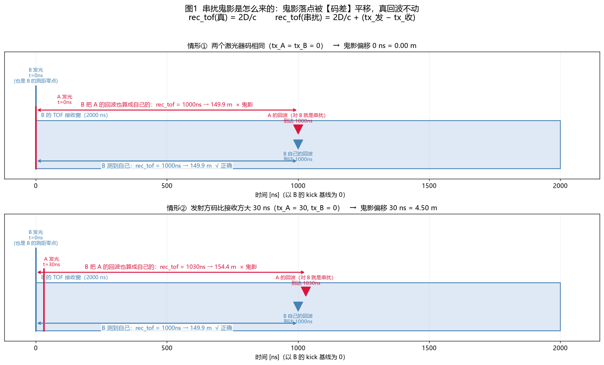
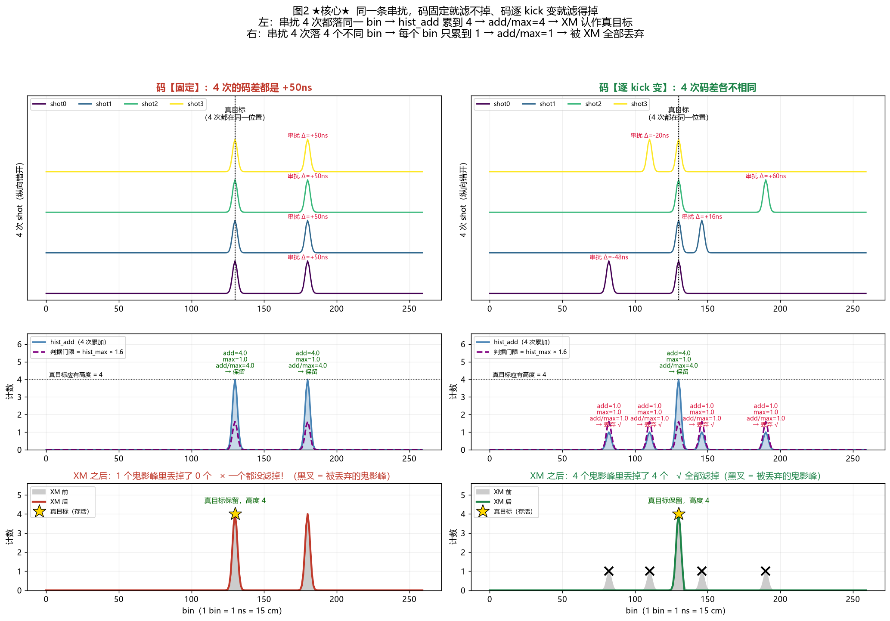
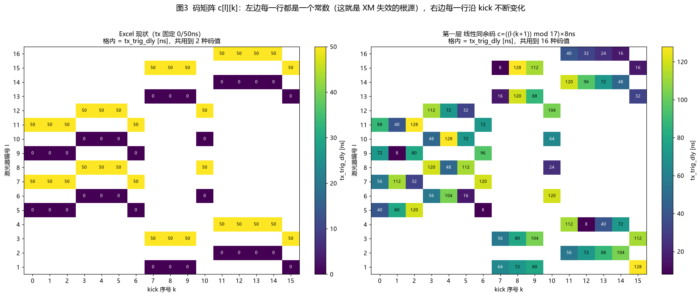
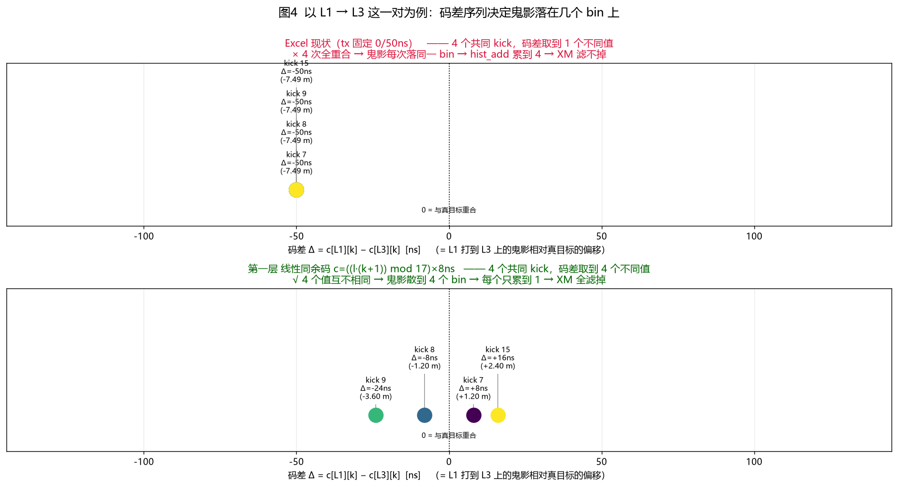
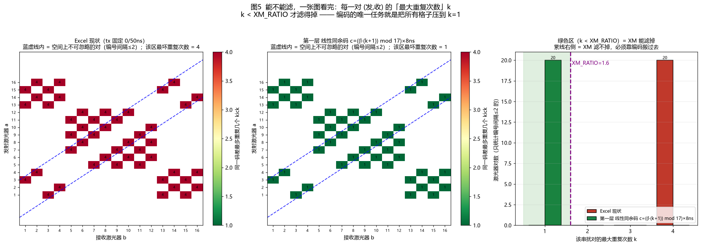
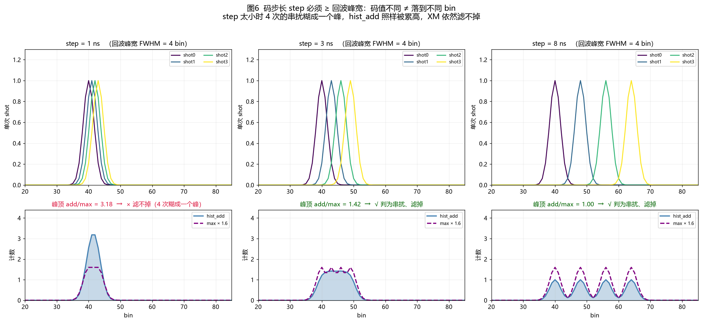
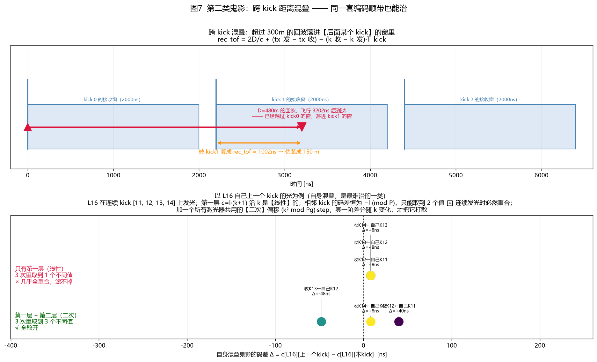
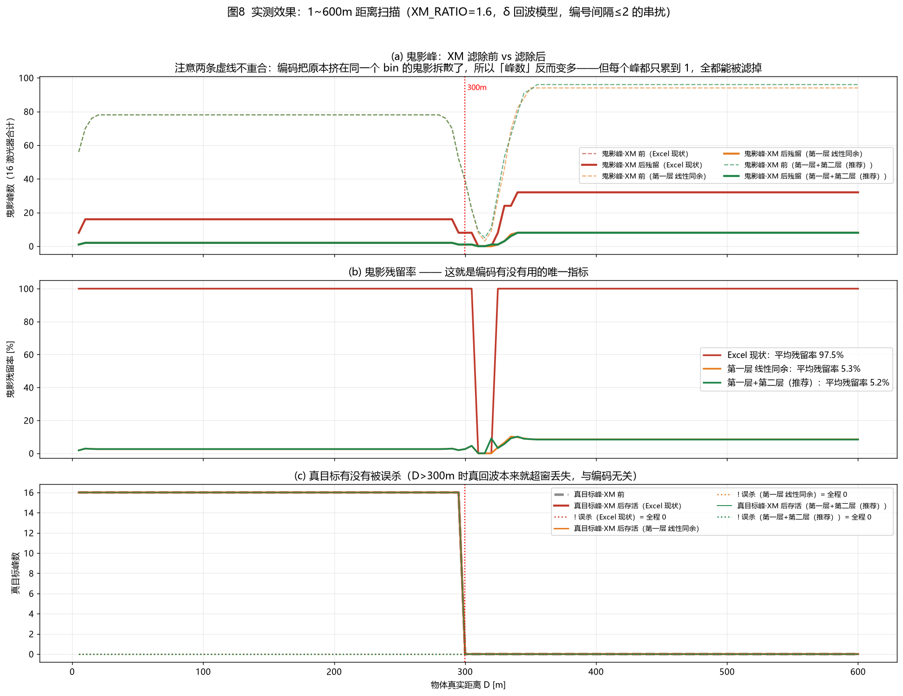
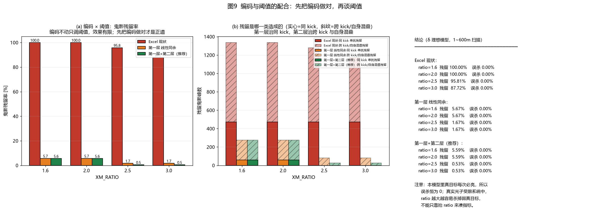

# tcode（发光时刻编码）方案 —— 原理、构造与图解

> **这份文档回答一个问题：为什么光有 XM 不够，编码到底怎么把串扰"变成"可以被滤掉的东西。**
>
> 配套代码：
> - 仿真 notebook：`crosstalk_sim_v20.ipynb`（XM 实装）、v21（tcode 实装）
> - 本文所有插图由 `docs/tcode/gen_tcode_figures.py` 生成，可直接重跑复现
>
> 缩写：
> **XM**（XtalkMark，串扰标记）、
> **TOF / ToF**（Time of Flight，飞行时间）、
> **SPAD**（Single-Photon Avalanche Diode，单光子雪崩二极管）、
> **IRF**（Instrument Response Function，仪器响应函数）、
> **LCG**（Linear Congruential，线性同余）、
> **FPGA**（Field-Programmable Gate Array，现场可编程门阵列）。

---

## 目录

1. [三十秒版结论](#1-三十秒版结论)
2. [鬼影是怎么来的：落点公式](#2-鬼影是怎么来的落点公式)
3. [XM 判据回顾：它到底在挑什么](#3-xm-判据回顾它到底在挑什么)
4. [核心图：码固定滤不掉，码变化滤得掉](#4-核心图码固定滤不掉码变化滤得掉)
5. [为什么 Excel 现有的码一定失效](#5-为什么-excel-现有的码一定失效)
6. [编码的设计目标：写成一条数学条件](#6-编码的设计目标写成一条数学条件)
7. [第一层：线性同余码（治同 kick 串扰）](#7-第一层线性同余码治同-kick-串扰)
8. [约束一：码步长必须 ≥ 回波峰宽](#8-约束一码步长必须--回波峰宽)
9. [约束二：码预算不能超过 kick 间隙](#9-约束二码预算不能超过-kick-间隙)
10. [第二层：逐 kick 全局二次偏移（治自身混叠）](#10-第二层逐-kick-全局二次偏移治自身混叠)
11. [实测效果：1~600m 距离扫描](#11-实测效果1600m-距离扫描)
12. [编码与阈值怎么配合](#12-编码与阈值怎么配合)
13. [v21 实施清单](#13-v21-实施清单)

---

## 1. 三十秒版结论

| | |
|---|---|
| **XM 在挑什么** | 挑「只在少数几次发光里出现过」的峰 |
| **真目标** | 每次发光都在 → `hist_add / hist_max = N_ACC = 4` |
| **串扰** | 希望它每次落在**不同**的 bin → 每个 bin 上 `add/max = 1` |
| **Excel 现状** | 每个激光器 4 个 kick 的 `tx_trig_dly` 是**同一个值** → 串扰 4 次落**同一** bin → `add/max = 4` → **和真目标完全一样，滤不掉** |
| **要做的事** | 让码**随 kick 变**，且任意一对激光器的**码差**在 4 个 kick 上互不相同 |
| **推荐构造** | `c[l][k] = ((l·(k+1)) mod 17)×8ns + ((k²) mod 9)×8ns` |
| **实测** | 鬼影残留率 **97.5% → 5.2%**（`xm_ratio=1.6`）或 **→ 0.53%**（`xm_ratio=2.5`），真目标误杀 **0** |

---

## 2. 鬼影是怎么来的：落点公式

一次发光既是**发射**，也开启一个 2000 ns 的**接收窗**。物体的回波会被**每一个**激光器收到，
只要它落在对方的窗里。接收方拿**自己**的发光时刻当测距零点，于是：

$$
\text{rec\_tof} \;=\; \underbrace{\frac{2D}{c}}_{\text{物体真实距离}}
\;+\; \underbrace{\big(tx_{\text{发}} - tx_{\text{收}}\big)}_{\textbf{码差}}
\;-\; \underbrace{\big(k_{\text{收}} - k_{\text{发}}\big)\cdot T_{\rm kick}}_{\text{跨 kick 混叠}}
$$

对**真回波**（发 = 收，同一 kick），后两项都是 0：

$$\text{rec\_tof}_{\text{真}} = \frac{2D}{c}\quad\textbf{与编码无关}$$

**这是整套方案的立足点：编码只搬鬼影，不搬真目标。**



上图两种情形对比：

- **情形①** 两个激光器码相同 → 串扰和真目标**重合在同一个 bin**（最糟：连位置都分不开）
- **情形②** 发射方码大 30 ns → 串扰被平移到 `+30ns = +4.50 m` 处

1 ns 的码差 = 15 cm 的鬼影位移。这就是我们唯一的操纵杆。

---

## 3. XM 判据回顾：它到底在挑什么

XM 的判据只有一条（详见 `crosstalk_sim_v20.ipynb` 的算法说明）：

$$\text{hist\_max}[b] \times \texttt{xm\_ratio} > \text{hist\_add}[b]
\;\Longrightarrow\; \text{丢弃}$$

两边同除 `hist_max` 后含义就清楚了：

$$\text{判串扰} \iff \frac{\text{hist\_add}[b]}{\text{hist\_max}[b]} < \texttt{xm\_ratio}$$

而 `add/max` 就是**这个峰在几次 shot 里出现过**：

| 峰的性质 | `add/max` | `xm_ratio=1.6` 时 |
|---|---|---|
| 真目标（4 次全在） | 4 | 保留 |
| 串扰只在 1 次出现 | 1 | **丢弃** |
| 串扰在 2 次落到同一 bin | 2 | 保留（滤不掉） |
| 串扰在 4 次落到同一 bin | 4 | 保留（和真目标一模一样） |

**所以编码的任务只有一句话：把每一条串扰的 `add/max` 从 4 压到 1。**

---

## 4. 核心图：码固定滤不掉，码变化滤得掉

这张图是整份文档的核心，把上面所有话变成了波形。



**左边（码固定，= Excel 现状）**

- 上：4 次 shot 里，串扰每次都出现在 `Δ=+50ns` 的同一个位置
- 中：累加后串扰峰 `add=4, max=1, add/max=4` → 判据门限 `max×1.6=1.6` 远低于 `add=4` → **判为真目标**
- 下：XM 之后串扰**原封不动**，1 个鬼影峰滤掉了 0 个

**右边（码逐 kick 变）**

- 上：4 次 shot 的串扰分别落在 `Δ = −48, +16, +60, −20 ns` 四个位置
- 中：4 个串扰峰各自只有 `add=1, max=1, add/max=1` → 门限 `1.6 > 1` → **全判为串扰**
- 下：4 个鬼影峰**全部丢弃**，真目标（高度 4，金色星）**毫发无损**

注意右图真目标峰的 `add/max` 依旧是 4 —— 因为编码根本没动它。**这就是"只杀鬼影不伤真身"的机理。**

---

## 5. 为什么 Excel 现有的码一定失效

看一眼码矩阵 `c[l][k]` 就明白了。



**左边是 Excel 现状**：每一行（一个激光器）沿 kick 方向都是**一个常数**（0 或 50）。
于是对任意一对 (发, 收)，码差 `c[a][k] − c[b][k]` 与 `k` 无关，是个**定值**。

把某一对激光器拎出来看得更直接：



- **上（Excel）**：L1→L3 的 4 个共同 kick，码差全是 `−50 ns`，4 个点**叠在同一个位置** → 鬼影 4 次落同一 bin → `add=4` → 滤不掉
- **下（线性同余码）**：4 个 kick 的码差是 `−24, −8, +8, +16 ns`，**4 个不同位置** → 鬼影散到 4 个 bin → 每个 `add=1` → 全滤掉

把**所有**激光器对一次看完：



定义 **k = 同一码差最多重复几个 kick**：

- `k = 1` → 完美散开，XM 全能滤（绿）
- `k = 4` → 完全重合，XM 全滤不掉（红）
- 判据是 `k < xm_ratio`

左图 Excel 现状：所有格子**全红（k = 4）**。
中图线性同余码：所有格子**全绿（k = 1）**。
右图统计：编号间隔 ≤ 2（空间上不可忽略）的 20 对激光器，从 20 对全在 `k=4`，变成 20 对全在 `k=1`。

**Excel 的码不是"编得不好"，是它根本没打算解决这个问题** —— 0/50ns 两档是为别的目的设的。

---

## 6. 编码的设计目标：写成一条数学条件

记 `c[l][k]` = 激光器 `l` 在第 `k` 个 kick 的 `tx_trig_dly`（单位 ns），
`K(l)` = 激光器 `l` 发光的 kick 集合（本系统 `|K(l)| = 4`）。

> **目标（同 kick 串扰）**
> 对任意一对激光器 `a ≠ b`，令 `S = K(a) ∩ K(b)`（共同发光的 kick），要求
> $$\big\{\,c[a][k] - c[b][k] \;:\; k \in S \,\big\} \quad\textbf{两两互不相同}$$
> 且任意两个值之差的绝对值 **≥ 回波峰宽**（见第 8 节）。

满足这条，则该对激光器造成的同 kick 串扰在 4 次 shot 里落到 4 个互不重叠的 bin，
每个 bin `add/max = 1`，被 XM 全部丢弃。

附带的两条约束：

> **约束一**：码差的最小间隔 ≥ 回波峰宽（否则码不同也糊在一个峰里，第 8 节）
> **约束二**：`max(c) ≤ T_kick − T_window = 2200 − 2000 = 200 ns`（第 9 节）

---

## 7. 第一层：线性同余码（治同 kick 串扰）

$$\boxed{\;c_1[l][k] \;=\; \Big(\big(l \cdot (k+1)\big) \bmod P\Big) \times \texttt{step}\;}
\qquad P = 17\ (\text{素数}),\quad \texttt{step} = 8\ \text{ns}$$

**为什么它一定满足第 6 节的目标**（三行证明）：

对一对激光器 `a ≠ b`，码差在模 `P` 意义下是

$$c_1[a][k] - c_1[b][k] \;\equiv\; (a-b)(k+1) \pmod P$$

1. `P = 17` 是素数，激光器编号 `1..16`，所以 `a − b ∈ [−15, 15]` 且 `a − b ≢ 0 (mod 17)`；
2. `k ∈ 0..15` ⟹ `k+1 ∈ 1..16`，两两在模 17 下互不相同；
3. 素数模下非零元素可逆，故 `(a−b)(k+1)` 对不同 `k` 给出**互不相同的余数**。

余数互不相同 ⟹ 实际码差（两个 `0..16` 余数之差再乘 `step`）也互不相同。**证毕。**

`P` 必须 **大于激光器数量** 且 **是素数**，这两条缺一不可：
不是素数就会出现零因子（比如 `P=16, a−b=8, k+1=2` 时乘积 ≡ 0，退化成常数）。

---

## 8. 约束一：码步长必须 ≥ 回波峰宽

**码值不同 ≠ 落到不同的峰。** 真实回波有宽度（IRF，约几个 ns），
如果码步长比峰宽还小，4 次的串扰会糊成一个宽峰，`hist_add` 照样被累高。



峰宽 FWHM = 4 bin 时：

| step | 峰顶 `add/max` | 结果 |
|---|---|---|
| 1 ns | **3.18** | × 滤不掉（4 次几乎完全重叠） |
| 3 ns | 1.42 | √ 勉强滤掉（已经很险） |
| 8 ns | **1.00** | √ 干净滤掉 |

**设计规则：`step ≥ 2 × FWHM`。** 本方案取 `step = 8 ns`（对应 1.2 m），
在 4 bin 峰宽下有 2× 裕度。

> 这条也解释了为什么本方案**不用** `delta_dly` 的 1/12 ns 细分来做第一层编码 ——
> 那个步长（0.083 ns）远小于峰宽，编了等于没编。`delta_dly` 的正确用途是探高反目标时的精细错峰，不是散串扰。

---

## 9. 约束二：码预算不能超过 kick 间隙

一次发光开启一个 2000 ns 的接收窗，相邻 kick 间隔 2200 ns，所以

$$\max_{l,k} c[l][k] \;\le\; T_{\rm kick} - T_{\rm window} \;=\; 2200 - 2000 \;=\; \mathbf{200\ ns}$$

超了，某个激光器的窗就会伸进下一个 kick，把本来干净的时间轴搅乱。

本方案的预算账：

| 项 | 最大值 |
|---|---|
| 第一层 `((l(k+1)) mod 17)×8` | `16 × 8 = 128 ns` |
| 第二层 `((k²) mod 9)×8` | `8 × 8 = 64 ns` |
| **合计** | **192 ns ≤ 200 ns** √ |

只剩 8 ns 余量，**很紧**。如果以后要加第三层，必须先做下面二选一：

- 把 `step` 降到 4 ns（要求 IRF 更窄），预算立刻降到 96 ns
- 把 `KICK_SPACING` 从 2.2 μs 放宽（会降帧率，需与系统折中）

`crosstalk_sim_v20.ipynb` 里有 `check_tcode_budget()` 自动核这笔账。

---

## 10. 第二层：逐 kick 全局二次偏移（治自身混叠）

第一层把**同 kick 串扰**治得很干净，但仿真跑完还剩 5.7% 鬼影。把残留翻出来分类，
结果非常整齐 —— **残留全部是同一类**：

```
残留成因统计（只有第一层，1~600m 扫描，xm_ratio=2.5，共 164 个残留峰）
  164 个  发射器相对编号 = 0     →  发射方就是接收方自己
          发射kick − 接收kick = −1 →  是自己【上一个 kick】的光
  —— 100% 是同一类，没有第二类。每个残留 bin 都是 add=3 / max=1。
```

即 **自身混叠**：物体距离 > 300 m 时，我自己上一个 kick 发的光超窗折回来，
落进本 kick 的窗里。它的码差是

$$\Delta_{\text{自混叠}} = c[l][k-1] - c[l][k]$$

**问题出在这里**：第一层 `c_1[l][k] = (l(k+1) \bmod P)\cdot\texttt{step}` 沿 `k` 是**线性**的，
所以它的一阶差分是常数：

$$c_1[l][k-1] - c_1[l][k] \;\equiv\; -l \pmod P \qquad \textbf{与 } k \textbf{ 无关！}$$

余数固定 ⟹ 实际码差最多只能取到 2 个值（差一个 `P·step` 的回卷）。
一旦某个激光器在**连续 kick** 上发光（比如 L16 在 kick 11/12/13/14），
3 个自混叠码差就**完全相同**，`add/max = 3`，XM 滤不掉。

### 解法：加一个"所有激光器共用"的二次偏移

$$\boxed{\;c[l][k] \;=\; \underbrace{\Big(\big(l(k+1)\big) \bmod 17\Big)\times 8}_{\text{第一层}}
\;+\; \underbrace{\Big(k^{2} \bmod 9\Big)\times 8}_{\text{第二层 } g[k]}\;}$$

第二项 `g[k]` **只跟 kick 有关，跟激光器无关**，这带来两个恰到好处的性质：

| 场景 | 码差里第二层的贡献 | 效果 |
|---|---|---|
| 同 kick 串扰（`k_发 = k_收`） | `g[k] − g[k] = 0`，**完全抵消** | 第一层的完美性**不被破坏** |
| 自身混叠（`k_发 = k_收 − 1`） | `g[k−1] − g[k] ≠ 常数` | **把第一层治不了的这类打散** |
| 真回波 | 接收方用自己的发光时刻当零点 | **完全不受影响** |

**为什么必须是二次而不是线性**：线性的 `g[k] = k·gstep` 一阶差分也是常数（`−gstep`），
帮不上忙（实测残留 164 → 164，纹丝不动）。二次项 `k²` 的一阶差分是 `2k−1`，**随 k 变化**，正好补上第一层缺的那个自由度。



下半张图就是 L16 的实例：

- **只有第一层**：3 次的自混叠码差全是 `+8 ns`，3 个点**叠在一起** → `add/max = 3` → 滤不掉
- **第一层 + 第二层**：变成 `−48, +8, +40 ns`，**3 个不同位置** → 全部 `add/max = 1` → 滤掉

实测：`xm_ratio = 2.5` 时残留从 **164 → 53**（残留率 1.67% → 0.53%）。

---

## 11. 实测效果：1~600m 距离扫描

模型与 `crosstalk_sim_v20.ipynb` 完全一致：16 激光器 × 4 次发光、δ 回波、1 ns bin、
只算编号间隔 ≤ 2 的串扰（更远的空间上可忽略）。距离 5~600 m，步长 5 m。



`xm_ratio = 1.6`（用户设定值）下的汇总：

| 编码 | 鬼影峰·XM 前 | 残留 | **滤除率** | 真目标峰 | **误杀** |
|---|---|---|---|---|---|
| Excel 现状 | 2696 | 2696 | **0.00 %** | 944 | 0 |
| 第一层 线性同余 | 9722 | 553 | **94.31 %** | 944 | 0 |
| 第一层 + 第二层 | 9834 | 553 | **94.38 %** | 944 | 0 |

**读这张表要注意两件事：**

1. **"XM 前"的峰数不一样（2696 vs 9722），这不是 bug。**
   Excel 码把大量鬼影**堆在同一个 bin**，多条鬼影只算 1 个峰；编码之后它们被**拆散**成很多个峰，
   所以峰数反而变多。但每个峰都只累到 1，全都能被滤掉 —— 拆散正是我们要的。
   要横向比较请看**残留率**（图 8(b)）：97.5% vs 5.2%。

2. **误杀全程为 0。** 编码不动真回波，`add/max` 恒为 4，判据不可能碰它。
   （理想 δ 模型下真目标每次必亮；真实光子受限系统里要另算，见下节。）

---

## 12. 编码与阈值怎么配合

一个自然的偷懒念头是：**不改编码，只把 `xm_ratio` 调大**行不行？



| `xm_ratio` | Excel 现状 | 第一层 | 第一层+第二层 |
|---|---|---|---|
| 1.6 | 100.00 % | 5.67 % | 5.59 % |
| 2.0 | 100.00 % | 5.67 % | 5.59 % |
| 2.5 | 95.81 % | 1.67 % | **0.53 %** |
| 3.0 | 87.72 % | 1.67 % | **0.53 %** |

（表内是**鬼影残留率**，越低越好。这里用的是**总量口径**：全程残留峰数 ÷ 全程鬼影峰数，
扫描步长 10 m；图 8(b) 用的是**逐距离口径**再取平均，所以 Excel 那一栏一个是 100%、
一个是 97.5%，两者都对，只是定义不同。）

**答案是不行。** 不改编码，`ratio` 从 1.6 抬到 3.0（已经贴着 `N_ACC=4` 的天花板，非常危险）
残留率也只从 100% 降到 87.7%。而编码做对之后，`ratio` 保持在安全的 1.6 就能拿到 5.6%。

**先把编码做对，再谈阈值。**

几个配套判断：

- **`ratio` 从 1.6 提到 2.5 值不值？** 编码做对后残留率 5.59% → 0.53%，收益很大。
  代价是真目标保护裕度从 `4/1.6 = 2.5×` 降到 `4/2.5 = 1.6×`。
  本模型里真目标每次必亮所以误杀恒为 0，但**真实光子受限场景下，弱目标少亮一次就会被误杀**，
  这条必须用实测 SPAD 数据核过再定。
- **剩下的 0.53%（53 个峰）是什么？** 查过了，成因也非常整齐：
  **来自两个不同激光器（编号 `−1` 和 `+2`）的跨 kick 鬼影，偶然撞进了同一个 bin**。
  这不是编码设计的漏洞 —— 第 6 节的条件是**逐对**定义的，管不了"不同对之间"的碰撞。
  本质是码空间有限（200 ns 预算 ÷ 8 ns 步长 ≈ 25 个槽）下的生日碰撞，
  再堆编码层收益递减。要继续压，路子是**次大值方案**（`add − max − max2`），
  它把可滤范围从「出现 1 次」扩到「出现 2 次」，而不牺牲真目标裕度。

---

## 13. v21 实施清单

**推荐方案**

```python
P, STEP   = 17, 8     # 第一层：素数模、码步长 [ns]
PG, GSTEP = 9,  8     # 第二层：模、码步长 [ns]

def tcode(laser_id, kick):
    """tx_trig_dly [ns]，1 ns 步长，最大 192ns ≤ 200ns 预算"""
    layer1 = ((laser_id * (kick + 1)) % P) * STEP      # 治同 kick 串扰
    layer2 = ((kick * kick) % PG) * GSTEP              # 治自身混叠
    return layer1 + layer2
```

**v21 要做的事**

| # | 任务 | 验收标准 |
|---|---|---|
| 1 | 把 `tcode()` 接进 `firings` 构建 | `check_tcode_budget()` 通过：`max(tx) ≤ 200 ns` |
| 2 | 码差矩阵自检 | 图 5 那张热图全绿（所有对 `k = 1`） |
| 3 | 自混叠码差自检 | 每个激光器的 `c[l][k−1] − c[l][k]` 互不相同 |
| 4 | 距离扫描 | 图 8(b) 残留率全程 < 1%（`xm_ratio = 2.5`） |
| 5 | 误杀核查 | 全程 0（δ 模型下应恒为 0，非 0 说明实现有 bug） |
| 6 | 参数扫描 | `P × step × Pg × gstep` 网格搜，在预算内找残留率最低组合 |

**还没做、需要单独立项的**

- **回波展宽**：把 δ 回波换成有限宽度（PULSE_W ≈ IRF），重新核 `step` 是否够（第 8 节）
- **幅度模型**：串扰强度按激光器间隔衰减，弱串扰可能压根到不了判据门限
- **光子噪声**：真目标不再"每次必亮"，`ratio` 的安全边界要重算 —— 这是决定 `ratio` 最终取值的关键实验
- **FPGA 8 ns 抖动**：作为第三层（逐 sync 随机）对抗**另一台雷达**的串扰；
  本文两层码是**模组内**编码，对付不了外来雷达（对方码表和我们无关）
- **次大值 / 软减法**：把 XM 从"出现 1 次"扩展到"出现 2 次"，见 v20 总结

---

## 附：重跑本文全部图

```bash
python docs/tcode/gen_tcode_figures.py
```

会读 `Elephant 时序表.xlsx`（读不到则用等价的合成时序兜底），
输出 9 张图到 `docs/tcode/img/`，并在终端打印本文所有表格里的数字。
