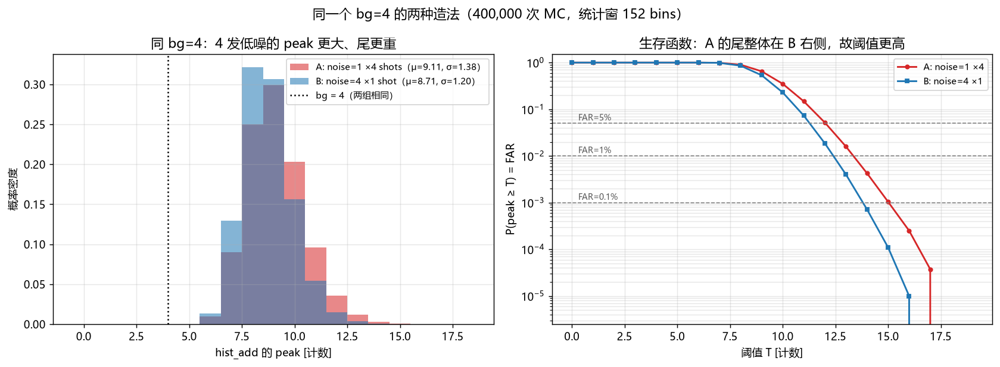
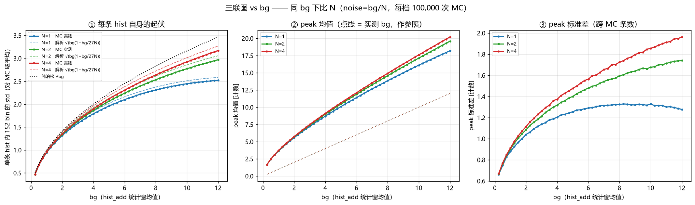

# 同 bg 下不同累加发数 N 的 peak 分布与阈值差异 —— 解析模型

> 配套脚本：`theory_peak_bg_multishot.py`（可直接运行，产出本文所有表格与
> `theory_peak_bg_multishot_fig.png`）。
> 直接 MC 验证：`check_same_bg_two_ways.py` → `check_same_bg_two_ways.png`（见 3.4 节）。
> bin 间相关诊断：`check_bin_correlation.py`（见 3.3 节）。
> 三联图扫描：`scan_hist_std_peak.py` → `scan_hist_std_peak_vs_bg.png` /
> `scan_hist_std_peak_vs_noise.png`（见第 12 节）。
> 配套仿真：`PoD_esti_v11.ipynb` 模块 10（统一 bg 网格，步长 0.25）。

## 0. 缩写

| 缩写 | 英文全称 | 含义 |
|---|---|---|
| SPAD | Single-Photon Avalanche Diode | 单光子雪崩二极管 |
| FAR | False Alarm Rate | 虚警率 / 噪点率 |
| MC | Monte Carlo | 蒙特卡洛 |
| EVT | Extreme Value Theory | 极值理论 |
| PoD | Probability of Detection | 探测概率 |

---

## 1. 结论速览

**同一个 bg 下，N 越大，peak 分布越宽、尾越重、阈值越高。**

差距不是常数倍，而是**随 bg 单调增长**：

| 量 | bg≈1（低噪） | bg≈6（中噪） | bg≈12（高噪） |
|---|---|---|---|
| 单 bin σ 之比 σ₄/σ₁ | 1.014 | 1.102 | 1.265 |
| peak 均值差 μ₄−μ₁ | +0.10 计数（+2.3%） | +0.95（+7.8%） | +2.55（+13.6%） |
| peak 标准差之比 s₄/s₁ | 1.047 | 1.219 | 1.524 |
| 阈值倍数 ρ₄=T₄/T₁ @FAR=1% | 1.033 | 1.110 | 1.195 |
| 阈值差 T₄−T₁ @FAR=1% | +0.23 计数 | +1.71 | +4.32 |
| 阈值差 T₄−T₁ @FAR=10 ppm | +0.46 计数 | +3.03 | +7.24 |

一句话根因：**bg 只锁定了均值，没有锁定分布形状。**
同 bg 时 N=1 的单发速率是 N=4 的 4 倍，而单发速率越高，SPAD 的
**二值饱和（每 bin 每 SPAD 最多 1 个计数）**越严重，计数分布越「欠离散」
（sub-Poisson），尾巴被压扁 → 阈值更低。

**因此「不同 N 的阈值差一个固定倍数」这个假设是错的**，只在 bg→0 时成立（ρ→1）。
如果在仿真曲线里看着像常数，多半是整数量化 + 有限 MC 造成的假象（见第 7 节）。

> **注意方向**：直觉上容易以为「1 发把噪声堆到 4」比「4 发每发 1」的峰更高，
> 结论是反的。3.4 节用 40 万次 MC 专门验证了这一点，并解释了为什么
> 「4 发的峰不会落在同一个 bin」虽然是事实，却不是决定胜负的量。

---

## 2. 记号与仿真口径

| 符号 | 含义 |
|---|---|
| `n_pix` = 27 | 宏像元 SPAD 数（9×3） |
| N | 累加发数，N ∈ {1, 2, 4} |
| `hist_i` | 第 i 发直方图，每 bin 计数 ∈ [0, 27] |
| `hist_add(N)` | 前 N 发之和，每 bin 计数 ∈ [0, 27N] |
| **noise** | 单发 `hist_i` 统计窗均值 |
| **bg** | `hist_add` 统计窗均值 = N · noise |
| **peak** | `hist_add` 在统计窗内的最大值 |
| M = 152 | 统计窗 bin 数（0–200 ns 掐头去尾各 24 ns，1 ns/bin） |

**v11 的对比方式**：固定目标 bg，令单发底噪 `noise = bg / N`。
于是三条曲线的横轴（bg）严格可比，唯一变量是「同样的总光子预算摊在几发上」。

---

## 3. 核心：同 bg 下单 bin 分布并不相同

### 3.1 精确的单 bin 边缘分布

每个 SPAD、每个 1 ns bin 是**二值**的：要么响应（计数 1），要么不响应（计数 0）。
设平衡态下单个 SPAD 在单个 bin 内响应的概率为 $p$。

- 同一 bin 内，27 个 SPAD 相互独立；
- 不同发之间相互独立（每发重新复位）。

所以 `hist_add(N)` 在**任意单个 bin** 上的分布是**精确的二项分布**：

$$X \sim \mathrm{Binomial}(M_{\mathrm{tr}},\, p),\qquad
M_{\mathrm{tr}} = 27N,\qquad p = \frac{\mathrm{bg}}{27N}$$

（$p$ 由 `r_det_for_noise(bg/N, 27)` 反解保证，使均值恰好等于 bg。）

**关键**：固定 bg 就是固定乘积 $M_{\mathrm{tr}}\,p=\mathrm{bg}$，但 $(M_{\mathrm{tr}}, p)$ 这一对本身随 N 变。

### 3.2 均值相同，方差不同

$$\mathbb{E}[X] = M_{\mathrm{tr}}\,p = \mathrm{bg} \quad(\text{与 N 无关})$$

$$\mathrm{Var}[X] = M_{\mathrm{tr}}\,p(1-p) = \mathrm{bg}\left(1 - \frac{\mathrm{bg}}{27N}\right)$$

定义 Fano 因子（方差/均值，泊松为 1）：

$$F_N(\mathrm{bg}) = 1 - \frac{\mathrm{bg}}{27N} = 1 - p$$

于是：

- $N\to\infty$（或 bg→0）：$F\to 1$，退化为**理想泊松**；
- N 有限且 bg 大：$F<1$，**欠离散**，N=1 最严重。

$$\boxed{\ \frac{\sigma_N}{\sigma_1}
= \sqrt{\frac{1-\mathrm{bg}/(27N)}{1-\mathrm{bg}/27}}\ }$$

| bg | σ(N=1) | σ(N=2) | σ(N=4) | σ₄/σ₁ |
|---|---|---|---|---|
| 1 | 0.981 | 0.991 | 0.995 | 1.014 |
| 3 | 1.633 | 1.683 | 1.708 | 1.046 |
| 6 | 2.160 | 2.309 | 2.381 | 1.102 |
| 9 | 2.450 | 2.739 | 2.872 | 1.173 |
| 12 | 2.582 | 3.055 | 3.266 | 1.265 |

> **物理解读**：bg=12、N=1 时，$p=12/27=0.44$ —— 每个 SPAD 在每个 bin 里有 44% 概率
> 已经响应过了，「还能再多响应一点」的余量很小，涨落被硬生生压住。
> 换成 N=4，$p=12/108=0.11$，离饱和远得多，涨落自由。

### 3.3 过阈窗 `T_OVER` 造成的 bin 间【正】相关

> **更正**：本节早先的版本写成「死时间使相邻 bin 负相关」，符号错了。
> 用 `check_bin_correlation.py` 实测后改为下述正确表述。

引擎里 bin 的「点亮」判据是（见 `noise_macro_hist_fast` 的注释）：

> **bin 被点亮 ⟺ 它之前最近一次雪崩距它 < `T_OVER` ≈ 8 ns**

所以一次雪崩会点亮**一连串约 8 个相邻 bin**（直到下一次雪崩把它截断）。
直方图不是「每 bin 独立计数」的叠加，而是**一堆 8 ns 宽矩形块的叠加**。
后果是相邻 bin 之间**强正相关**，不是负相关。

实测自相关函数（20000 次 MC，bg=4、N=4）：

| lag | 0 | 1 | 2 | 3 | 4 | 5 | 6 | 7 | 8 | 9 |
|---|---|---|---|---|---|---|---|---|---|---|
| ACF | 1.000 | 0.865 | 0.731 | 0.598 | 0.466 | 0.334 | 0.202 | 0.071 | −0.060 | −0.059 |

近似 $\rho(L)\approx\max(0,\,1-L/8)$ —— 正是宽度 8 的矩形窗的三角形自相关，
过零点恰在 lag = `T_OVER` = 8 ns。

**这对本模型的两层影响，必须分清**：

| 层次 | 是否受影响 | 实测 |
|---|---|---|
| **单 bin 边缘分布** = Binomial(27N, $p_{\mathrm{eq}}$) | **不受影响，精确成立** | 实测方差 / 二项预言 = **0.999**（六个工况全部） |
| **max over 152 bin** 的独立假设 | **明显受影响** | 有效独立 bin 数 $M_{\mathrm{eff}}\approx 46$–$76$，远小于 152 |

也就是说：**第 3.2 节的方差公式（全部结论的基础）是精确的**，
只有第 4 节把 152 个 bin 当独立的那一步需要打折扣，它只影响 peak 的绝对值。

顺带一个可直接测的推论：由于正相关，**单条 hist 内 152 个 bin 的样本方差**
会系统性地**低于**单 bin 边缘方差：

$$\mathbb{E}[s^2] = \sigma^2\Big[1 - \tfrac{1}{M(M-1)}\textstyle\sum_{j\ne k}\rho_{jk}\Big]
\;\approx\; 0.956\,\sigma^2$$

实测比值 0.955–0.965（六个工况），对应平均成对相关 $\bar\rho\approx +0.035$–$0.046$。
这正是 `scan_hist_std_peak.py` 三联图 ① 里 MC 曲线略低于解析虚线的原因。

### 3.4 常见直觉误区：「4 发的峰不会对齐，所以 4 发的 peak 更小」

这是一个很自然、而且**前半句完全正确**的直觉，但结论反了。先把它说清楚。

**直觉的说法**：noise=1、N=4（bg=4）时，每发 `hist_i` 的峰只有 noise=1 那个量级，
而且 4 发的峰几乎不可能落在同一个 bin，所以加起来的峰不会很大；
反过来 noise=4、N=1（同样 bg=4）是「一发就把噪声堆到 4」，峰应该更高。

**实测（`check_same_bg_two_ways.py`，40 万次 MC，用项目自己的引擎）**：

| 量 | A: noise=1 × 4 发 | B: noise=4 × 1 发 |
|---|---|---|
| 实测 bg | 4.0007 | 3.9998 |
| **peak 均值** | **9.114** | **8.706** |
| peak 标准差 | 1.380 | 1.205 |
| T @ FAR=1% | 14 | 13 |
| T @ FAR=0.1% | 16 | 14 |

前半句被证实了：A 组每发自己的 peak 平均只有 3.66，
**4 发峰位完全重合的比例只有 0.001%**，
「假如完美对齐」的上界是 4×3.66 = 14.63，而实际 `hist_add` 的 peak 只有 9.11，
**仅为对齐上界的 62%**。峰确实完全没有对齐。

但结论反了：**A（4 发低噪）的 peak 反而比 B（1 发高噪）大 4.7%，阈值高 1–2 个计数。**

**错在哪**：`hist_add` 的 peak **不是**由各发的 peak 叠出来的。运算顺序是
**先逐 bin 求和，再对 bin 取最大**，不是「先各发取最大，再求和」：

$$\mathrm{peak} = \max_j \sum_{i=1}^{N} h_i[j]
\quad\neq\quad \sum_{i=1}^{N} \max_j h_i[j]$$

右边（各发峰之和）才是「对齐上界」14.63，左边才是真实的 9.11。
所以「峰对不对齐」只决定你离那个上界有多远，**不决定 A、B 谁大**。

**真正的判据**：固定某一个 bin，比较两组求和后的分布。两组均值都锁死在 bg=4，
所以胜负完全由**方差**决定：

| | 单 bin 分布 | 均值 | 方差 | Fano |
|---|---|---|---|---|
| A | Binomial(108, 0.0370) | 4.000 | **3.852** | 0.963 |
| B | Binomial(27, 0.1481) | 4.000 | 3.407 | 0.852 |

A 的方差更大 → 极值更大。至于为什么 A 方差大，就是 3.2 节：
B 组单发要把噪声堆到 4，$p=0.148$，27 个 SPAD 里已经有 15% 处于「用掉了」的状态，
涨落被二值上限压住；A 组每发只有 $p=0.037$，离饱和很远。

**一般判据（决定谁大的唯一标准）**：设单发单 bin 计数的均值为 $m$、方差为 $v(m)$，
则 N 发之和的方差是 $N\,v(\mathrm{bg}/N)$：

| 单发统计性质 | $v(m)$ | N 发之和的方差 | 谁的 peak 大 |
|---|---|---|---|
| **理想泊松** | $m$ | $\mathrm{bg}$（**与 N 无关**） | 一样大，N 无所谓 |
| **欠离散**（二值上限、死时间）← 本仿真 | $m(1-m/27)$ | $\mathrm{bg}(1-\mathrm{bg}/27N)$，**随 N 增大** | **N 大的更大** |
| **超离散**（光子聚束、发间速率抖动） | $m+m^2/k$ | $\mathrm{bg}+\mathrm{bg}^2/(kN)$，**随 N 减小** | N 小的更大 |

所以这个直觉**并非无稽之谈**：如果探测器是超离散的（比如有明显后脉冲串、
串扰簇发，或环境光在发与发之间有大幅速率抖动），那么「1 发高噪的峰更大」就是对的。
**只是本仿真的 SPAD 是严格 1 bit 的**，每 bin 每 SPAD 最多 1 个计数，
天生欠离散，所以符号是反的。

> 顺带说明：泊松那一行也很重要 —— 它说明**如果没有饱和，多发累加在同 bg 下毫无区别**。
> 本文讨论的全部差异，都是「偏离泊松」的效应。



---

## 4. 从单 bin 到 peak：极值统计

peak 是统计窗内 M=152 个 bin 的最大值。按独立近似：

$$P(\mathrm{peak} < T) = F_X(T-1)^{M}$$

$$\mathrm{FAR}(T) = P(\mathrm{peak}\ge T) = 1 - F_X(T-1)^{M}
\;\approx\; M\cdot P(X \ge T)$$

所以**阈值取的是单 bin 分布的极深尾分位**：

$$P(X \ge T)\ \le\ \alpha_{\mathrm{bin}} = 1-(1-\mathrm{FAR})^{1/M} \approx \frac{\mathrm{FAR}}{M}$$

| FAR | $\alpha_{\mathrm{bin}}$ | 等效高斯分位 $z$ |
|---|---|---|
| 1% | 6.6×10⁻⁵ | 3.82 |
| 100 ppm | 6.6×10⁻⁷ | 4.84 |
| 10 ppm | 6.6×10⁻⁸ | 5.29 |

**这就是差距被放大的地方**：均值完全相同、σ 只差 26%，
但要比的是 $10^{-7}$ 量级的尾概率，尾部形状的差别会被指数放大。

---

## 5. 阈值模型：三个精度层次

### 层次 A：高斯极值闭式（看趋势用）

$$T_N(\mathrm{bg}) \approx \mathrm{bg} + z_\alpha\,\sigma_N
= \mathrm{bg} + z_\alpha\sqrt{\mathrm{bg}\left(1-\frac{\mathrm{bg}}{27N}\right)}$$

倍数：

$$\rho_{N/1} = \frac{T_N}{T_1}
= \frac{\sqrt{\mathrm{bg}} + z_\alpha\sqrt{1-\mathrm{bg}/(27N)}}
       {\sqrt{\mathrm{bg}} + z_\alpha\sqrt{1-\mathrm{bg}/27}}$$

这个式子直接说明了**为什么 ρ 不是常数**：分子分母各有一个不随 bg 变的
$\sqrt{1-\cdot}$ 项和一个随 bg 变的 $\sqrt{\mathrm{bg}}$ 项，两者权重此消彼长。

- $\mathrm{bg}\to 0$：$\rho\to 1$；
- $\mathrm{bg}$ 增大：饱和项差异显现，$\rho$ 上升；
- $\mathrm{bg}\gg z^2$（本仿真到不了）：$\sqrt{\mathrm{bg}}$ 主导，$\rho$ 又回落向 1。

**局限**：二项/泊松在小均值时强烈右偏，高斯尾不够重，绝对值明显偏低
（bg=1、FAR=1% 时高斯给 4.75，精确值 7）。趋势对，数值别用。

### 层次 B：大偏差修正（解释「倍数从哪来」）

对 $\mathrm{Binomial}(M_{\mathrm{tr}}, p)$ 用 Chernoff/大偏差：

$$-\ln P(X\ge T) \;\approx\; I(T)
= T\ln\frac{T}{\mathrm{bg}} + (M_{\mathrm{tr}}-T)\ln\frac{M_{\mathrm{tr}}-T}{M_{\mathrm{tr}}-\mathrm{bg}}$$

当 $T \ll M_{\mathrm{tr}}$ 时展开：

$$\boxed{\;I(T) \approx
\underbrace{T\ln\frac{T}{\mathrm{bg}} - T + \mathrm{bg}}_{\text{纯泊松（}N\to\infty\text{）}}
\;+\;
\underbrace{\frac{(T-\mathrm{bg})^2}{2\cdot 27N}}_{\text{二值饱和修正}}\;}$$

**第二项就是全部差别的来源**：它是正的（压低尾概率），大小 $\propto 1/N$。
N 越大，这一项越小，尾越接近泊松，阈值越高。

对固定 $I=L\equiv-\ln\alpha_{\mathrm{bin}}$ 做一阶微扰（$\mathrm{d}I_\infty/\mathrm{d}T=\ln(T/\mathrm{bg})$）：

$$T_N \approx T_\infty - \frac{(T_\infty-\mathrm{bg})^2}{2\cdot 27N\,\ln(T_\infty/\mathrm{bg})}$$

$$\boxed{\;T_4 - T_1 \approx \frac{3}{4}\cdot
\frac{(T_\infty-\mathrm{bg})^2}{54\,\ln(T_\infty/\mathrm{bg})}\;}$$

其中 $T_\infty$ 解 $T\ln(T/\mathrm{bg})-T+\mathrm{bg}=L$。

验证（FAR=1%，与精确二项的连续阈值对比）：

| bg | $T_\infty$ | T₁(闭式) | T₁(精确) | T₄(闭式) | T₄(精确) | ΔT(闭式) | ΔT(精确) |
|---|---|---|---|---|---|---|---|
| 2 | 10.92 | 10.06 | 9.17 | 10.71 | 9.63 | +0.65 | +0.46 |
| 6 | 19.62 | 16.72 | 15.60 | 18.89 | 17.32 | +2.17 | +1.71 |
| 12 | 30.15 | 23.53 | 22.18 | 28.49 | 26.50 | +4.97 | +4.32 |

闭式把 ΔT 高估约 15–40%（因为 bg 大时 $T-\mathrm{bg}$ 已不满足「远小于 $M_{\mathrm{tr}}$」），
但**量级、趋势、$1/N$ 标度都对**，可以用来做手算估计。

### 层次 C：精确二项极值（给数）

直接对 $\mathrm{Binomial}(27N,\ \mathrm{bg}/(27N))$ 求生存函数，取满足
$P(X\ge T)\le\alpha_{\mathrm{bin}}$ 的最小整数 T。脚本里的 `thr_indep()`。
第 6 节的数都出自这里。

---

## 6. 正常会差多少（定量表）

### 6.1 阈值倍数 ρ（连续阈值，已去掉整数台阶）

用 `thr_continuous()` 在 $\ln$ 生存函数上插值，得到实数阈值，才能看清趋势。

| bg | ρ₂@1% | ρ₄@1% | ρ₂@100ppm | ρ₄@100ppm | ρ₂@10ppm | ρ₄@10ppm |
|---|---|---|---|---|---|---|
| 0.5 | 1.014 | 1.021 | 1.020 | 1.029 | 1.022 | 1.033 |
| 1 | 1.022 | 1.033 | 1.029 | 1.043 | 1.033 | 1.048 |
| 2 | 1.034 | 1.050 | 1.045 | 1.067 | 1.050 | 1.073 |
| 4 | 1.055 | 1.082 | 1.071 | 1.106 | 1.078 | 1.117 |
| 6 | 1.074 | 1.110 | 1.096 | 1.142 | 1.106 | 1.157 |
| 8 | 1.093 | 1.137 | 1.121 | 1.178 | 1.134 | 1.197 |
| 10 | 1.112 | 1.165 | 1.147 | 1.216 | 1.163 | 1.239 |
| 12 | 1.133 | 1.195 | 1.176 | 1.256 | 1.196 | 1.286 |

**规律**：
1. ρ **单调随 bg 上升**，从 1.02 一路到 1.20~1.29；
2. **FAR 越严，ρ 越大**（尾越深，饱和差异被放得越开）；
3. ρ₂ 与 ρ₄ 的关系近似 $\rho_2-1\approx \tfrac{2}{3}(\rho_4-1)$，
   与修正项 $\propto(1-1/N)$ 的预言一致
   （$1-1/2=0.5$ 对 $1-1/4=0.75$，比值 0.67）。

### 6.2 阈值绝对差 T₄−T₁（计数）

| bg | @1% | @100ppm | @10ppm |
|---|---|---|---|
| 0.5 | +0.11 | +0.20 | +0.25 |
| 1 | +0.23 | +0.38 | +0.46 |
| 2 | +0.46 | +0.76 | +0.91 |
| 4 | +1.04 | +1.61 | +1.90 |
| 6 | +1.71 | +2.58 | +3.03 |
| 8 | +2.47 | +3.68 | +4.29 |
| 10 | +3.35 | +4.90 | +5.68 |
| 12 | +4.32 | +6.27 | +7.24 |

**工程经验式**（本参数组下）：

$$T_4 - T_1 \;\approx\; c_\alpha \cdot \mathrm{bg},\qquad
c_{1\%}\approx 0.22\text{–}0.36,\quad
c_{100\mathrm{ppm}}\approx 0.38\text{–}0.52,\quad
c_{10\mathrm{ppm}}\approx 0.45\text{–}0.60$$

（系数在区间内随 bg 缓慢上升。）

### 6.3 peak 均值与标准差

| bg | μ₁ | μ₂ | μ₄ | s₁ | s₂ | s₄ | μ₄−μ₁ | 相对 |
|---|---|---|---|---|---|---|---|---|
| 0.5 | 3.09 | 3.12 | 3.14 | 0.62 | 0.63 | 0.64 | +0.05 | +1.5% |
| 1 | 4.34 | 4.41 | 4.44 | 0.72 | 0.75 | 0.76 | +0.10 | +2.3% |
| 2 | 6.31 | 6.46 | 6.54 | 0.86 | 0.90 | 0.93 | +0.23 | +3.7% |
| 4 | 9.47 | 9.85 | 10.03 | 1.00 | 1.10 | 1.15 | +0.56 | +5.9% |
| 6 | 12.17 | 12.81 | 13.12 | 1.07 | 1.23 | 1.30 | +0.95 | +7.8% |
| 8 | 14.58 | 15.54 | 16.00 | 1.10 | 1.32 | 1.43 | +1.42 | +9.7% |
| 10 | 16.79 | 18.12 | 18.74 | 1.10 | 1.39 | 1.54 | +1.95 | +11.6% |
| 12 | 18.83 | 20.58 | 21.38 | 1.07 | 1.45 | 1.63 | +2.55 | +13.6% |

要点：

- **peak 均值差是「亚线性放大」的 σ 差**。EVT 关系约为
  $\mu_{\mathrm{peak}} \approx \mathrm{bg} + a_M\,\sigma$，$a_M\approx\sqrt{2\ln M}=3.17$；
  所以 $\Delta\mu \approx a_M(\sigma_4-\sigma_1)$。bg=12 时
  $3.17\times(3.266-2.582)=2.17$，与精确值 2.55 同量级。
- **peak 标准差的差距比均值大得多**：bg=12 时 s₄/s₁=1.52。
- **s₁ 在 bg≳8 之后不升反降**（1.099 → 1.096 → 1.067）：
  这是 N=1 撞上二值硬上限 27 的压缩效应，是一个很好的判据 ——
  如果仿真里看到 N=1 的 peak 标准差在高 bg 端掉头向下，说明饱和已经主导。

---

## 7. 为什么仿真里可能「看起来像常数倍数」

三个假象来源，看模块 10 的图时必须先排除：

1. **整数量化**。T 是整数，$\rho=T_N/T_1$ 只能取有理数台阶。
   bg=2、FAR=1% 时精确整数阈值是 10/10/10 → ρ₄=1.000，
   但连续阈值是 9.17/9.47/9.63 → ρ₄=1.050。
   **一个计数的量化误差在 T≈10 时就是 10%**，足以淹没真实趋势。
   → **对策：看 T₄−T₁（整数差），或用连续阈值插值，不要直接看比值。**

2. **有限 MC 的尾部噪声**。FAR=10 ppm 在 10⁶ 条 MC 下只有约 10 个越阈事件，
   阈值的统计不确定度本身就有 ±1 计数量级。
   → **对策：ρ 的结论优先用 FAR=1%（约 10⁴ 个事件）下的曲线。**

3. **bg 范围太窄**。ρ 在 bg∈[0.25, 3] 内确实几乎是常数（1.02→1.06）。
   只有扫到 bg≈12 才能看出明显斜率。
   → v11 的 `BG_GRID` 已经扫到 12，够用。

---

## 8. 模型的已知不足

| 近似 | 影响 | 实测 / 敏感性 |
|---|---|---|
| **M=152 个 bin 视为独立** | `T_OVER` 使相邻 bin **正**相关，$M_{\mathrm{eff}}\ll 152$，真实 peak 与 T 偏低 | 由 peak 反推 $M_{\mathrm{eff}}\approx$ 46（bg=1）、57–59（bg=4）、64–76（bg=12）。**绝对值有影响，ρ>1 的定性结论不变** |
| 单 bin 用二项 | 边缘分布是精确的（$p_{\mathrm{eq}}$ 已匹配均值） | 实测方差/预言 = 0.999，**无需修正** |
| 忽略串扰 / 后脉冲 | 会额外增加正相关，抬高 peak 尾 | 本仿真未建模 |
| 忽略 bin 间信号泄漏 | 纯噪声分析不涉及 | — |

有意思的是 $M_{\mathrm{eff}}$ 随速率**上升**（46 → 76）：速率越高，雪崩越密，
8 ns 的点亮块越容易被下一次雪崩截断 → 块变短 → 相关变弱 → 有效 bin 变多。
这一点对 N=1 更明显（同 bg 下 N=1 单发速率最高），所以它**部分抵消**了
N=1 因饱和而变窄的劣势 —— 这也是实测 ΔT 比解析闭式略小的原因之一。

### 8.1 与直接 MC 的实测对比（bg=4，40 万次）

| 量 | 解析模型（独立 bin） | 引擎 MC | 差 |
|---|---|---|---|
| peak 均值，N=1 | 9.47 | 8.71 | −0.77 |
| peak 均值，N=4 | 10.03 | 9.11 | −0.92 |
| **差值 μ₄−μ₁** | **+0.56** | **+0.41** | −0.15 |
| T @ FAR=1%，N=1 | 13 | 13 | 0 |
| T @ FAR=1%，N=4 | 14 | 14 | 0 |

**绝对 peak 均值模型偏高约 0.8–0.9 个计数**，正是独立 bin 假设的代价
（死时间让 $M_{\mathrm{eff}}<152$）。但**方向、量级、阈值整数值都对上**，
差值 μ₄−μ₁ 也只差 0.15 计数。

因此：**用本模型判断「差多少倍、往哪个方向差、随 bg 怎么变」是可靠的；
用它预测 peak 均值的绝对值会偏高约 1 个计数（阈值因为整数取整反而常常正好对上）。**

---

## 9. 二值硬上限：N=1 在高 bg 端会直接失效

N=1 的单 bin 计数上限是 27。阈值逼近 27 时，不但 ρ 失真，PoD 也无法定义
（notebook `solve_pod_noise()` 会打 `invalid="阈值超过二值硬上限"`）。

| FAR | bg=8 | bg=10 | bg=11 | bg=12 |
|---|---|---|---|---|
| 1% | T₁=19（余 8） | 21（余 6） | 22（余 5） | 23（余 4） |
| 100 ppm | 21（余 6） | 23（余 4） | 24（余 3） | 25（余 2） |
| 10 ppm | 22（余 5） | 24（余 3） | 25（余 2） | **26（余 1）** |

**结论**：单发（N=1）在 bg≳12、FAR=10 ppm 时已经贴到硬上限，
再高的 bg 就没有可用阈值了。这本身就是「多发累加」最硬的物理理由：
**N 发把动态范围从 27 扩到 27N。**

---

## 10. 与 `PoD_esti_v11.ipynb` 模块 10 的对照清单

按顺序检查，逐条判定模型是否成立：

| # | 检查项 | 模型预言 | 对应图 |
|---|---|---|---|
| 1 | 同 bg 下三个 N 的 peak 均值 | N 越大越高，bg=12 时差 +13.6% | 10D / 9.1 |
| 2 | $\mu_{\mathrm{peak}}/\mathrm{bg}$ 随 N 分开 | 分开，且 bg 越大分得越开 | 10D 左 |
| 3 | $\sigma_{\mathrm{peak}}/\sqrt{\mathrm{bg}}$ 随 N 分开 | 分开；N=1 在 bg≳8 掉头向下 | 10D 右 |
| 4 | ρ₄ vs bg | 从 1.02 单调升到 1.20（1% FAR） | 10B |
| 5 | ρ 是否常数 | **否**；残差图应有明显系统性斜率 | 10C |
| 6 | ρ 随 FAR 变严而增大 | 1% < 100 ppm < 10 ppm | 10B 三联图 |
| 7 | $\rho_2-1 \approx \tfrac23(\rho_4-1)$ | 成立 | 10B |

若第 5 项看到的是「水平 + 随机抖动」，先按第 7 节的三条假象排查
（优先怀疑整数量化），再怀疑模型。

---

## 11. 复现

```powershell
$env:PYTHONIOENCODING="utf-8"
python theory_peak_bg_multishot.py                      # 解析模型，表 1–8 + 四联图
python check_same_bg_two_ways.py --n-mc 400000          # 3.4 节的定向对照
python check_bin_correlation.py --n-mc 20000            # 3.3 节的相关诊断
python scan_hist_std_peak.py --workers 20 --n-mc 100000 # 第 12 节的三联图
```

---

## 12. 三联图：三个量随噪声的变化（MC 实测）

`scan_hist_std_peak.py` 在统一 `BG_GRID`（0.25→12，步长 0.25）上，
每档 100,000 次 MC，N=1/2/4，输出三个量：

1. **单条 hist 内 152 个 bin 的样本标准差**，再对 MC 条数取平均（叠加解析虚线）
2. **peak 均值**
3. **peak 标准差**（跨 MC 条数）

出两版横轴：`_vs_bg.png`（同 bg 比 N，推荐）与 `_vs_noise.png`（同单发底比 N）。



抽样数值（横轴 bg）：

| bg | N=1 histσ / peakμ / peakσ | N=2 | N=4 |
|---|---|---|---|
| 0.25 | 0.469 / 1.65 / 0.662 | 0.470 / 1.66 / 0.668 | 0.470 / 1.66 / 0.672 |
| 2.25 | 1.392 / 6.01 / 1.062 | 1.421 / 6.14 / 1.125 | 1.435 / 6.20 / 1.159 |
| 4.25 | 1.836 / 9.06 / 1.226 | 1.918 / 9.36 / 1.344 | 1.956 / 9.51 / 1.409 |
| 6.25 | 2.131 / 11.72 / 1.294 | 2.282 / 12.24 / 1.496 | 2.351 / 12.47 / 1.596 |
| 8.25 | 2.331 / 14.14 / 1.329 | 2.565 / 14.90 / 1.605 | 2.675 / 15.26 / 1.738 |
| 10.25 | 2.457 / 16.38 / 1.314 | 2.798 / 17.45 / 1.681 | 2.953 / 17.93 / 1.868 |

**读图要点**：

- **①**：三条 MC 曲线在 bg≲2 完全重合，之后按 N 分开，N=1 最先偏离纯泊松 √bg 并压平
  （bg=12 时 2.52 vs 3.17）。MC 比解析虚线系统性低约 4.5%，
  就是 3.3 节的正相关效应（$\mathbb{E}[s^2]\approx0.956\sigma^2$），
  **两条曲线的相对间距与解析一致**。
- **②**：peak 均值三条几乎平行上升，N 越大越高；bg=12 时 N=1/2/4 = 18.21 / 19.60 / 20.20。
  与 bg 参照线（点线）的距离就是「峰高出底多少」。
- **③**：差别最大的一张。**N=1 的 peak 标准差在 bg≈8 达到 1.33 后掉头向下**
  （bg=12 时 1.28），而 N=4 一路升到 1.96。
  这正是 6.3 节预言的「撞二值硬上限 27 的压缩效应」，是饱和已经主导的最直观判据。
